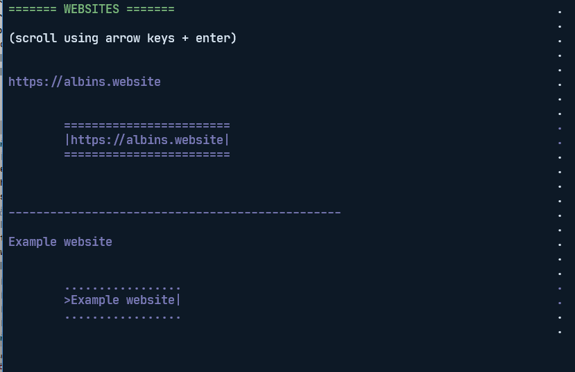

## a web-like browsable index of websites in your terminal

blop creates a small little network of websites that you can browse in your terminal.

### hosted version:
`Telnet blop.sweetpotato.online`

*(lowercase "t" if using linux or macos)*

> **Landlubbers!** Learn how to install Telnet:
> * Windows: [here](https://social.technet.microsoft.com/wiki/contents/articles/38433.windows-10-enabling-telnet-client.aspx)
> * MacOS: [here](https://osxdaily.com/2018/07/18/get-telnet-macos/)
> * Linux: [here](https://linuxhint.com/linux-telnet-command/)

Learning how to navigate blop is probably a good idea too, see the [usage instructions](Usage_instructions.md).
___

## learn more about blop

#### what is blop?

as already said, blop is bits of code that i put together to create the ability to create websites for the terminal.
these websites can be hosted by anyone and accessed via the "superbrain" which is a server running over telnet.

#### how does it work?

it's quite simple actually (and a bit silly, but i wanted to have some fun...). websites are registrered to an index
using the [website index api](web_server/website_index_handler). upon connecting to the superbrain telnet server, the client will receive a list of websites along with some instructions.

websites are written in ***plain ol' html*** with the support of ***inline styles*** (because someone's gotta use them when they get deprecated, right?).
styling and the options of tags are both simple and limited because we're working with the terminal.

***sending and receiving data*** is supported to some extent (via input boxes in forms). therefore, you can create chat apps! there is already an example available.

***contributions*** are always welcome, including ones that extend the availability of tags.

#### how do i add my website?

first, follow the website creation guide which you can find [here](Website_creation_guide.md).

then, follow the website addition guide which you can find [here](web_server/website_index_handler/README.md).

#### how can i run my own superbrain?

head over to the folder than the [superbrain](web_server) lives in to find out what you need! (a hint for curious landlubbers:
you need python and that's pretty much it)

#### i want to run more than just the superbrain!

sure! you can run the whole platform if you want. there are lots of parts included - take what you need, and have fun!
see below for a list.

**to run a local clone of the blop platform, follow the installation instructions for the following things:**

* [superbrain](web_server/README.md) - Telnet server
* [skipper](web_server/content_renderer/README.md) - content renderer and downloader
* [compass](web_server/website_index_handler/README.md) - website index handler

#### parts included in the platform

here is a little breakdown of what has been coded and included within blop:
> **Note:** while the names for the services and tools are fancy, the directory names 
> are straight-to-point and very practical: they have "conventional" names
> like `web_server`, `content_render`, etc.
* `skipper` - a format translator and content renderer that breaks down HTML-like documents into blocks which can be directly stringified.
  * `format_translator.py` - the main translator file
  * `converters.py` - converts HTML tags to elements - either to strings directly or to classes which can be stringified
  * `sourceloader.py` - this is the skipper's helping hand! it loads a source, either a file or a website and translates it.
* `superbrain` - a telnet server that uses `skipper` to get, render, and navigate on websites.
* `compass` - a website index handler for the `superbrain` start page. easily customizable using jinja templates.
  * includes a web server with an API for updating websites
  * also includes `index_checker.py` to remove irrelevant websites from the index (doesn't respond properly etc.)
  * also includes `index_file_generator.py` to generate a starting page for blop customizable with jinja templates.

*example websites collection* 
* `veronica` - a simple chat app using flask and mysql to store messages. support for different channels.
* `albins example website` - sorry it doesn't have quite a flashy name as everything else, but it's a stripped-down version of my [personal website](https://albins.website)
and my [GitHub bio](https://github.com/sotpotatis) mish-mashed together.
* `form testing server` - this does not have a fancy name either, but you can use it to explore the form data sending function.

#### drawbacks & stuff that is not implemented

as you start exploring the platform, you'll realize that some things might appear weird to you.
why does it do that? first of all, you're welcome with contributions.
and second, yes, i know. some of the weirdness might come from that the platform is based on HTML syntax
and that the behavior of everything isn't entirely inherited from HTML.

judge this project as what it is: a *Telnet server that can render simple HTML-like websites into terminal text and display it to the user*.
if the project is somewhat interesting to you - why not make something for it? it helps it gain attention which leads to contributions.