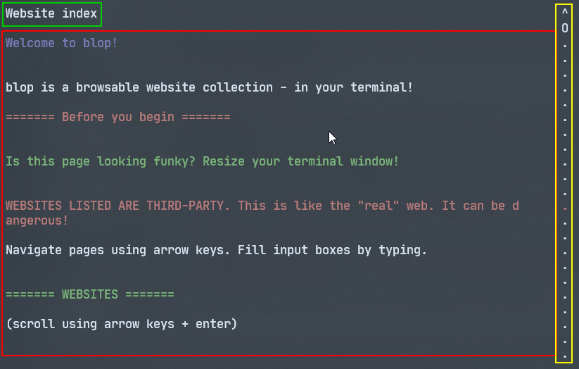
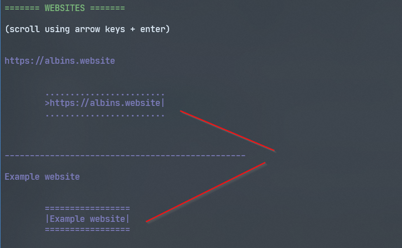
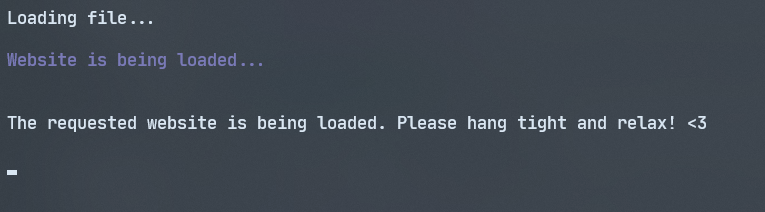
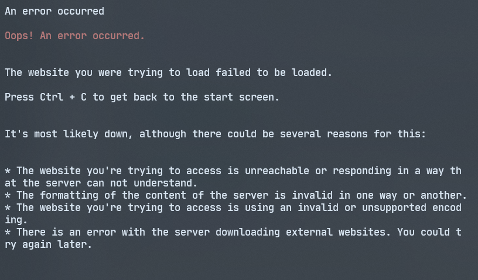

# usage instructions
learn how to get started with blop!

--> for a guide on how to create websites, see [here](Website_creation_guide.md)!

### connecting to the platform

connect to the platform by opening a terminal and connecting via Telnet to a server
that hosts the platform. if you aren't connecting to a custom server, the default is
`blop.sweetpotato.online`.

 * 🪟 Windows: `Telnet blop.sweetpotato.online`

 * 🍎 Mac: `telnet blop.sweetpotato.online`

 * 🐧 Linux: `telnet blop.sweetpotato.online`

**don't have the telnet command? there are installation instructions in the [README](readme.md) file.**

footnote: you can also access the platform with a Telnet client that isn't in the terminal, but
since blop uses escape codes made for the terminal, you have to make sure that the client
you're using supports them.

### navigating: general

the basics is that you **have to press the enter key** to send any actions you want to make
to the server.
so, if you want to scroll down, you'd hit the arrow key once and then hit enter to make the page scroll.
the same goes when filling in textboxes. this isn't that neat, but i haven't figured out a workaround.

to *exit* completely, hit **Ctrl+Q+Enter** on your keyboard.

to *exit* a particular website and go back to the start page, hit **Ctrl+C+Enter** on your keyboard.

### navigating the start page

the start page will present you with an introduction to the platform:

the *green box* is the *website title*.

the *red box* is the *website content*.

the *yellow box* is the scrollbar with the "O" representing the current scroll position.

#### finding a website to go to

find a website by scrolling the website index. this is done by hitting the down or up arrow and then enter afterwards.

once you first go to the website, the button to go to the first website is going to be highlighted:

as you can see in the picture above, the first button on the first website is selected.
to move between active buttons, hit the left or right arrow keys plus enter.

when you've found the website to go to, hit enter. you should be presented with a loading screen:

if all good, you should be presented with the website.

##### if the website is down

if the website is down, you should get the following error:

hit ctrl +c to get back to the start screen in such case.
